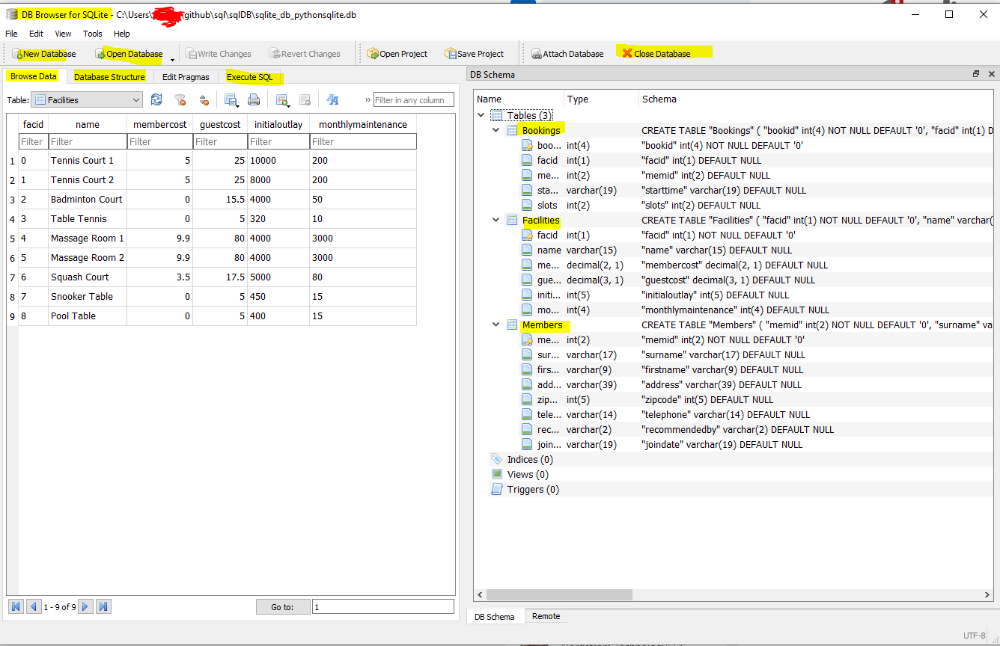
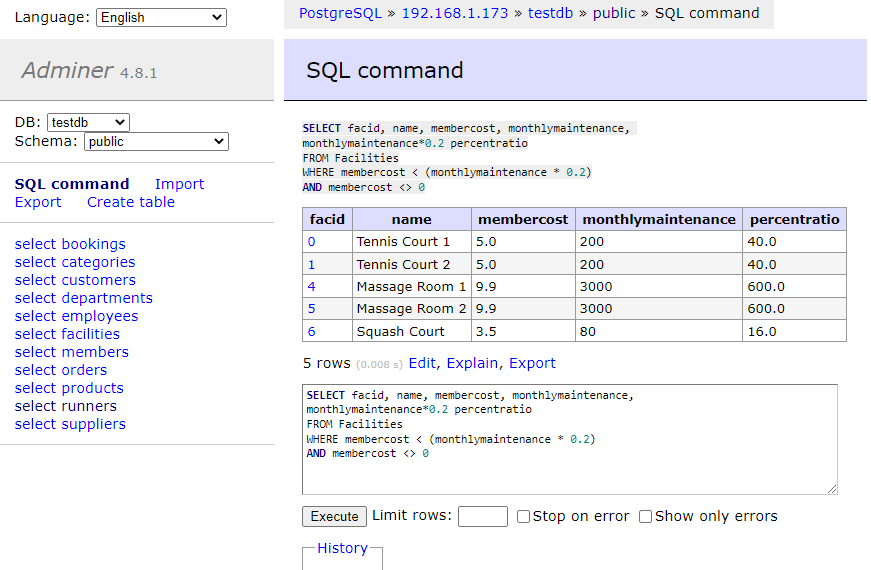

# SQL
This will be useful for all who have a basic understanding  of sql or have dabbled with it
at work or school and would like to learn more.

- [sql - joins](joins/README.md) - inner joins,  left, right, full outer joins 
- [sql - analytical](analytical/README.sql) - min, max, average, case, windows functions

# Install steps 1 - option 1
- this will be an easier option
- please install sqllite browser- [download here](https://sqlitebrowser.org/dl/)
- Screen capture of sqlitebrowser, see below: 

- See below, selecting database file for **executing joins sql** section

- See below, selecting database file for **executing analytical sql** section

# Install step 2 - option 2
- this gives you the full flavour of a real RBMS.
- This is using docker to deploy postgresql in a docker container
- [Steps to create local database server instance using docker container](./setup-postgresql.md)
- Screen capture:

# Familiarize

- For joins section use database **joins/joins.db**
Before starting this section explore the all tables in the database.
>If you ever want to create and upload data again, drop database and create a new database via DB Browser SQLite
>> joins/create_tables_ddl.sql 
> 
>> joins/insert_sql_dml.sql

 
- For analytical section use **analytical\analytical.db**
Before starting with the questions, take your time to explore the all the above 4 tables and get acquainted with them.
Open db browserlite, File --> Open Database -->analytical\sqlite_db_pythonsqlite.db
The db file --> sql\sqlDB\sqlite_db_pythonsqlite.db, is a database file, it contains 4 tables 
and the "Runners" table is used for exploring windows function.

>If you ever want to create and upload data again, drop database and create a new database via DB Browser SQLite
>> analytical/create_table.sql
> 
>> analytical/insert_rows.sql

# [Visualize Joins Another Way](joins/VisualizeJoinsAnotherWay.md)

## Sql Injection
- https://www.stackhawk.com/blog/what-is-sql-injection/

Resources
--------------------
- springboard
- [basic sql](https://blog.codinghorror.com/a-visual-explanation-of-sql-joins/)
- [sql explained in venn diagram](https://stackoverflow.com/questions/13997365/sql-joins-as-venn-diagram)    
- https://www.techonthenet.com/sql/joins.php
- https://docs.oracle.com/database/121/SQLRF/ap_standard_sql001.htm#SQLRF55514
- https://docs.actian.com/vector/4.2/index.html#page/SQLLang/ANSI_2fISO_Join_Syntax.htm

- **Window functions**
    - https://drill.apache.org/docs/sql-window-functions-introduction/
    - https://www.windowfunctions.com/
    - https://www.windowfunctions.com/questions/over/
    - https://docs.aws.amazon.com/redshift/latest/dg/c_Window_functions.html
    - https://medium.com/@rohitgupta_82488/resources-to-master-sql-984447e462ca 

- **Tools**
    - https://sqlitebrowser.org/
    - https://download.sqlitebrowser.org/DB.Browser.for.SQLite-3.12.2-win64.msi
    - [Sqllite Studio also seems to be a good option](https://sqlitestudio.pl/)

