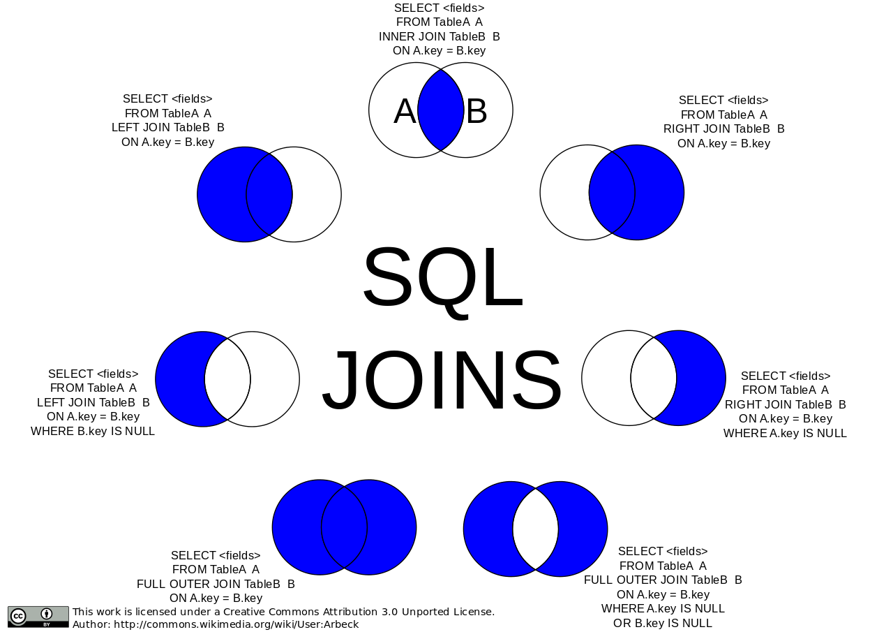

# Basic SQL
- 

Tables
-----------------------
<pre>

Table A
Col1   Col2
1       A11
2       A21
3       A31

Table B
Col1   Col3
2       B22
3       B32
4       B42
</pre>

- A INNER JON B --> A Intersect B 
<pre>
Result:
Col1   Col2    Col3
1       A11    NULL
2       A21    B22
3       A31    B32
</pre>

- A LEFT JOIN B  --> {1,2,3,4,5,6}
- A RIGHT JOIN B --> {2,5,6,7,8,9}

# Resources:
- [basic sql](https://blog.codinghorror.com/a-visual-explanation-of-sql-joins/)
- [sql explained in venn diagram](https://stackoverflow.com/questions/13997365/sql-joins-as-venn-diagram)    
- https://www.techonthenet.com/sql/joins.php