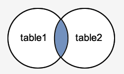
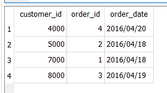
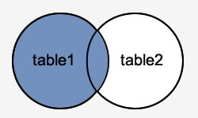
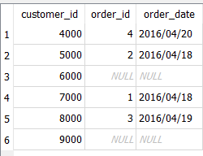
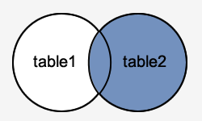
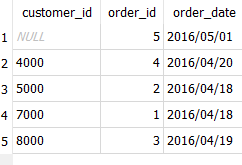
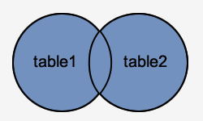

# Basic SQL
- 

- JOIN/INNER JOIN
<pre>
SELECT columns
FROM table1 
INNER JOIN table2
ON table1.column = table2.column;

In this visual diagram, the SQL INNER JOIN returns the shaded area:
</pre>

Example
<pre>
SELECT customers.customer_id, orders.order_id, orders.order_date
FROM customers 
INNER JOIN orders
ON customers.customer_id = orders.customer_id
ORDER BY customers.customer_id;
Results:
4 records selected
</pre>

- LEFT OUTER JOIN in SQL is:
<pre>
SELECT columns
FROM table1
LEFT [OUTER] JOIN table2
ON table1.column = table2.column;

In this visual diagram, the SQL LEFT OUTER JOIN returns the shaded area:
</pre>

<pre>
SELECT customers.customer_id, orders.order_id, orders.order_date
FROM customers 
LEFT OUTER JOIN orders
ON customers.customer_id = orders.customer_id
ORDER BY customers.customer_id;

Results:
In this LEFT OUTER JOIN example would return all rows from the customers table and only those rows from the orders table
where the joined fields are equal.
If a customer_id value in the customers table does not exist in the orders table, all fields in the orders table will
display as NULL in the result set. As you can see, the rows where customer_id is 6000 and 9000 would be included with a
LEFT OUTER JOIN but the order_id and order_date fields display NULL.
</pre>

- SQL RIGHT OUTER JOIN
Another type of join is called a SQL RIGHT OUTER JOIN. This type of join returns all rows from the RIGHT-hand table specified in the
  ON condition and only those rows from the other table where the joined fields are equal (join condition is met).
<pre>
SELECT columns
FROM table1
RIGHT [OUTER] JOIN table2
ON table1.column = table2.column;

In this visual diagram, the SQL RIGHT OUTER JOIN returns the shaded area:
</pre>  

<pre>
SELECT customers.customer_id, orders.order_id, orders.order_date
FROM customers 
RIGHT OUTER JOIN orders
ON customers.customer_id = orders.customer_id
ORDER BY customers.customer_id;

NOTE:: RIGHT OUTER JOIN NOT supported by sql dblite, alernamte sql, using LEFT OUTER JOIN flippping the table position

SELECT customers.customer_id, orders.order_id, orders.order_date
FROM  orders
LEFT OUTER JOIN customers
ON customers.customer_id = orders.customer_id
ORDER BY customers.customer_id;

Results:
There will be 5 records selected.
This RIGHT OUTER JOIN example would return all rows from the orders table and only those rows from the customers table
where the joined fields are equal.

If a customer_id value in the orders table does not exist in the customers table, all fields in the customers table will
display as NULL in the result set. As you can see, the row where order_id is 5 would be included with a RIGHT OUTER JOIN
but the customer_id field displays NULL.
</pre>

- SQL FULL OUTER JOIN
Another type of join is called a SQL FULL OUTER JOIN. This type of join returns all rows from the LEFT-hand table and 
  RIGHT-hand table with NULL values in place where the join condition is not met.
<pre>
SELECT columns
FROM table1
FULL [OUTER] JOIN table2
ON table1.column = table2.column;

Visual diagram, the SQL FULL OUTER JOIN returns the shaded area. The SQL FULL OUTER JOIN would return the all records 
from both table1 and table2.
</pre>

<pre>
SELECT customers.customer_id, orders.order_id, orders.order_date
FROM customers 
FULL OUTER JOIN orders
ON customers.customer_id = orders.customer_id
ORDER BY customers.customer_id;

NOTE:: FULL OUTER JOIN is not supported by sqldblite, alternate sql
SELECT * FROM 
(
	SELECT customers.customer_id, orders.order_id, orders.order_date
	FROM customers 
	LEFT OUTER JOIN orders
	ON customers.customer_id = orders.customer_id
	UNION
	SELECT customers.customer_id, orders.order_id, orders.order_date
	FROM orders
	LEFT OUTER JOIN customers 
	ON customers.customer_id = orders.customer_id
)
ORDER BY customer_id

</pre>

- Cartesian Products
If two tables in a join query have no join condition, then Oracle Database returns their Cartesian product. Oracle 
combines each row of one table with each row of the other. A Cartesian product always generates many rows and is 
rarely useful. For example, the Cartesian product of two tables, each with 100 rows, has 10,000 rows. Always include 
a join condition unless you specifically need a Cartesian product. If a query joins three or more tables and you do 
not specify a join condition for a specific pair, then the optimizer may choose a join order that avoids producing 
an intermediate Cartesian product.

- Equijoins
An equijoin is a join with a join condition containing an equality operator. An equijoin combines rows that have 
equivalent values for the specified columns. Depending on the internal algorithm the optimizer chooses to execute 
the join.
  

  

**NOTE:** ANSI SQL92 - supports both RIGHT AND FULL OUTER JOIN, it is jsut that the SQLite has not implemneted these

# Resources:
- [basic sql](https://blog.codinghorror.com/a-visual-explanation-of-sql-joins/)
- [sql explained in venn diagram](https://stackoverflow.com/questions/13997365/sql-joins-as-venn-diagram)    
- https://www.techonthenet.com/sql/joins.php
- https://docs.oracle.com/database/121/SQLRF/ap_standard_sql001.htm#SQLRF55514
- https://docs.actian.com/vector/4.2/index.html#page/SQLLang/ANSI_2fISO_Join_Syntax.htm
