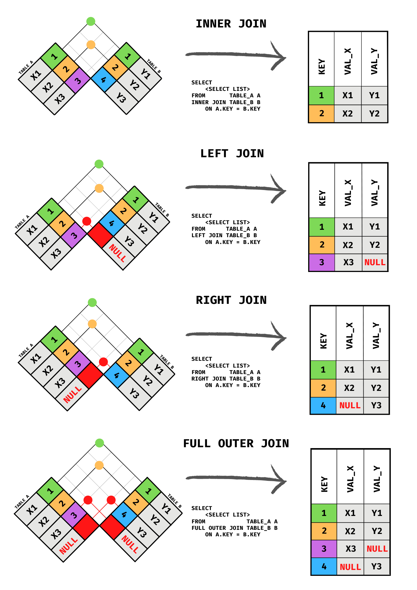
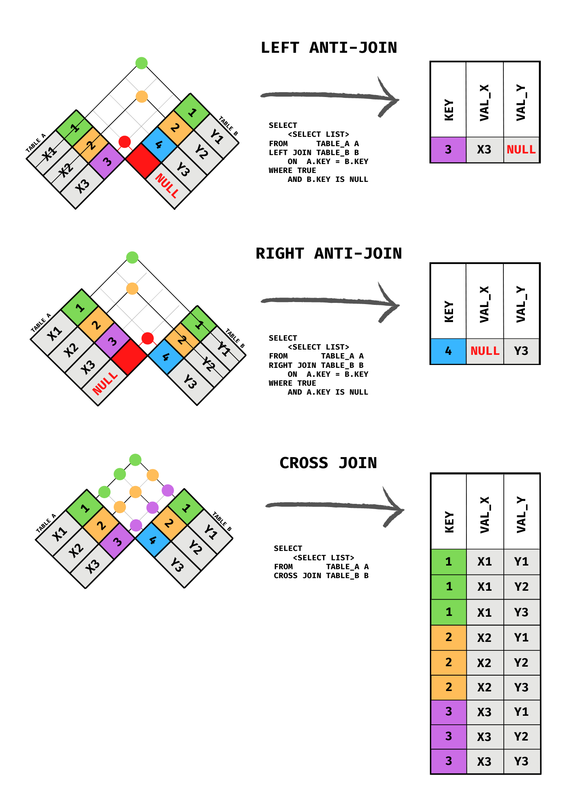

# Visualize SQL Joins Another Way

Visualizing joins without using Venn diagramns. Please remember though, that the best way to truly understand SQL joins
is to get in the code and practice!

## Joins - inner, left, right, full outer
- 

## Joins - anti joins - left and right, cross  
- 

- [Reference](https://github.com/amartinson193/SQL_Checkered_Flag_Join_Diagrams)